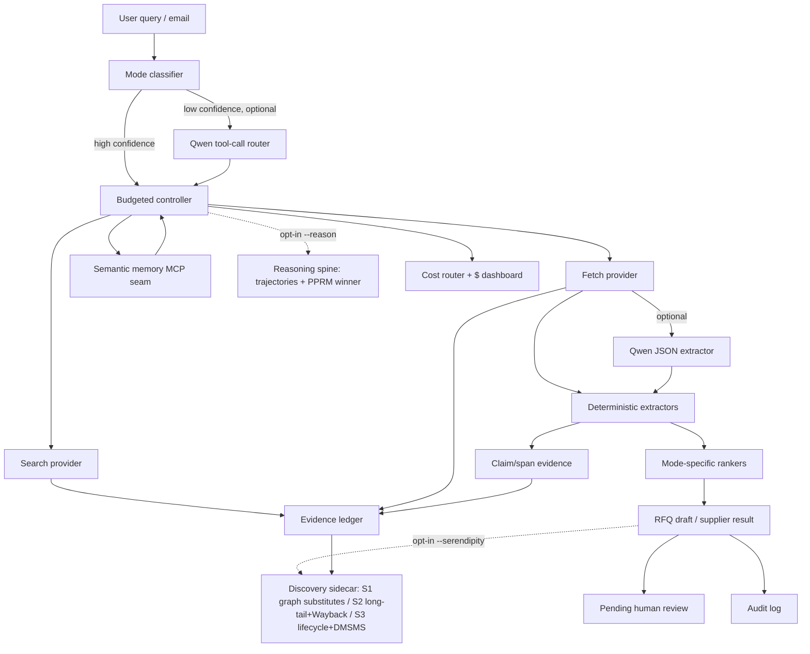

# spider-qwen

<p align="center">
  <picture>
    <source media="(prefers-color-scheme: dark)" srcset="spider-qwen-logo-darkmode.png">
    
  </picture>
</p>

**Spider-Qwen: procurement intelligence that hunts, maps, verifies, and recommends.**

Spider-Qwen is an agentic procurement scout built to map the supplier web,
detect commercial signals, and turn messy external information into sourcing
decisions. Give it a query like *"Find office cleaning vendors in Singapore and
prepare RFQ drafts"* and it returns an evidence-backed vendor shortlist plus
ready-to-review RFQ drafts — without ever submitting or sending anything.

It behaves like a digital sourcing analyst: it receives a buyer's request,
searches public sources through approved providers, verifies vendor evidence,
compares options, prepares recommendations, and leaves findings for human review.
Operational estimate: for routine supplier discovery and RFQ drafting, the goal
is to reduce research from hours of manual tab-hopping to minutes of
evidence-backed draft preparation.

- **Qwen-native layer:** optional Qwen JSON extraction (DashScope `json_object` mode), low-confidence tool-call routing, domain skill prompts, and an in-process MCP-compatible memory seam.
- **Web layer:** [TinyFish](https://docs.tinyfish.ai) Search + Fetch (primary), Qwen WebExtractor (single-page fallback), deterministic mocks for demos.
- **Guarantee:** every vendor / contact / price / RFQ output references ledger evidence; extracted claims carry span metadata when available.

> Current scope: `search (SEA/geo templates + Step-Back/HyDE expansion) → concurrent fetch
> → extract → rank → RFQ draft → persist evidence + memory`.
> **No** portal submission, browser automation, or code interpreter.
>
> **Serendipity slots.** Every run exposes a four-slot `serendipity` view
> (`primary_answer` + `s1`/`s2`/`s3`), the default lightweight view built from rank
> positions. Opt into `--serendipity` for a discovery **sidecar** that populates
> S1/S2/S3 from the real components — multi-hop graph substitutes (PPR-ranked, CoVe-verified),
> long-tail/archived sources, and lifecycle/PCN + DMSMS risk — each item carrying
> `evidence_refs` + its `source_component`. The sidecar runs after the normal
> pipeline on already-fetched evidence (no extra fetch budget) and leaves the
> default output unchanged; full default-pipeline integration is a v2 item.

## Brand concept

Procurement is network work: suppliers, sub-suppliers, contracts, risks,
categories, lead times, market prices, compliance documents, and hidden
dependencies. The spider metaphor fits because the agent does not merely search;
it connects signals across the web and identifies where procurement should act.

- **Spider web:** supplier networks, market signals, RFQ trails, contract relationships.
- **Sharp gothic forms:** precision, authority, controlled aggression.
- **Monochrome palette:** serious enterprise intelligence, not playful SaaS.
- **Predatory tone:** actively hunts opportunities and risks instead of passively waiting.
- **Qwen reference:** the reasoning engine behind the agentic search layer.

## Why "evidence-first"

Procurement decisions need provenance. Every search result, fetched page, and
extracted fact is written to an append-only **evidence ledger** with SHA-256
hashes and timestamps. Downstream outputs carry lightweight `EvidenceRef`
pointers (`ledger_id`) back into that ledger — never bare URLs. Claim evidence
stores `claim_id`, `parent_ledger_id`, `start_char`, `end_char`, and `span_hash`
when the fact maps to fetched page text, and `spider-qwen evidence verify`
rechecks those spans. A ranked candidate with no evidence is dropped, not scored.

## Why Qwen 3.7

Qwen 3.7-Max is the planner/controller in spirit: deep-thinking reasoning over a
1M-token context for multi-hop substitute discovery and trajectory selection,
while the cheap, high-volume work — extraction, classification, page judging,
query expansion — routes to Qwen 3.5-Flash through the cost router. When live
token metering is wired, the report includes `$-saved-vs-all-max`; otherwise it
marks token metering unavailable. The hot path stays deterministic (regex/heuristic
extractors, no LLM) for reproducibility; Qwen adds JSON-constrained extraction,
low-confidence tool-call routing, project skill prompts, and an MCP surface. Model
IDs are policy-configured (the `models:` block), never hard-coded, so a dated
snapshot can be pinned for demo reproducibility.

## Project status

Spider-Qwen is an open-source (MIT) reference implementation of an evidence-first
procurement research agent. The core pipeline and the supporting layers
(reasoning spine, discovery sidecar, memory loop, cost router, MCP server, Qwen
Agent Skills) are implemented and covered by the offline test suite; everything
runs deterministically with `--offline`, so the project is usable and verifiable
without API keys. Contributions are welcome — open an issue or PR. Items still on
the roadmap are listed under [Known limits / v2 roadmap](#known-limits--v2-roadmap).

## Install

Requires **Python 3.11+**.

```bash
git clone <repo> && cd spider-qwen
pip install -e ".[dev]"           # core + test deps
# optional extras:
pip install -e ".[qwen]"          # Qwen WebExtractor (openai SDK)
pip install -e ".[server]"        # FastAPI HTTP server
```

Copy `.env.example` to `.env` and add your keys (`.env` is gitignored — never commit it).

## Quickstart

No API keys needed — `--offline` uses deterministic mock providers:

```bash
spider-qwen classify "office cleaning Singapore"
spider-qwen run "office cleaning Singapore" --offline
spider-qwen run "500 ergonomic chairs Singapore" --mode product_exact_price --offline
spider-qwen evidence show <run_id>
spider-qwen evidence verify <run_id>
spider-qwen evidence graph <run_id>
spider-qwen memory show
spider-qwen review list
spider-qwen skills list                       # project Qwen Agent Skills
spider-qwen benchmark --gold-set spider_qwen/benchmarks/gold_set.json
```

Opt-in modes (default `run` output is unchanged):

```bash
# Discovery sidecar: populate S1/S2/S3 from real components (graph/Wayback/signals/DMSMS)
spider-qwen run "find a replacement for an obsolete Hirose DF13-6P-1.25DSA, deliver to Singapore in 14 days" --offline --serendipity
# Multi-trajectory reasoning spine (PPRM winner selection -> ReasoningResult)
spider-qwen run "NE5532 substitute" --offline --reason
# Judged demo profile: Qwen extraction + verification/trust surfaces + S1/S2/S3
spider-qwen run "office cleaning Singapore" --offline --judged-demo
# Cost router: high-risk forces the decision step to the max-tier model
spider-qwen run "obsolete connector substitute" --offline --high-risk
```

Example output (trimmed):

```json
{
  "run_id": "run_abc123",
  "mode": "service_quote_required",
  "stop_reason": "min_validated_candidates_met",
  "validated_candidates": [
    {
      "vendor_name": "Example Cleaning Pte Ltd",
      "website": "https://example-cleaning.sg",
      "pricing_status": "QUOTE_REQUIRED",
      "quote_channel": { "type": "contact_email", "value": "sales@example-cleaning.sg",
        "evidence_ref": { "ledger_id": "ev_001", "url": "...", "snippet_hash": "...", "retrieved_at": "..." } },
      "score": 82.5
    }
  ],
  "rfq_drafts": [ { "status": "complete", "rfq_email_template": "Dear ...", "quote_channel": {"...": "..."} } ],
  "evidence_refs": [ "..." ]
}
```

## Architecture



Opt-in layers (dotted) leave the default pipeline unchanged: `--reason` runs the
multi-trajectory reasoning spine, `--serendipity` runs the discovery sidecar over
the run's ledger, and the cost router records routing plus token-metering status.

## Procurement modes

| Mode | When | Output |
|---|---|---|
| `product_exact_price` | products with expected public pricing | priced candidates with `PricingStatus` + evidence |
| `service_quote_required` | services where price is quote-only | vendor shortlist + quote channel + **RFQ draft** |
| `contact_enrichment_only` | you have vendors, need contacts | evidence-backed contacts + validation signals |
| `revalidation` | refresh a stale memory fact | refreshed/`stale`/`disputed` fact (manual in v1) |
| `electronics_substitution` | obsolete / EOL part needs a replacement | substitute candidates + FFF/lifecycle gate; S1/S2/S3 via `--serendipity` discovery |

### Pricing ontology

`EXACT_PRICE · PRICE_RANGE · STARTING_FROM · RATE_CARD_FOUND · QUOTE_REQUIRED ·
CONTACT_FOR_PRICING · NOT_FOUND · CONFLICTING`. A missing price is **never** a
global failure — it becomes `NOT_FOUND`/`CONTACT_FOR_PRICING` and only blocks
`product_exact_price`, which requires a price by contract.

## Providers (swappable)

Selected via env or injection; both abstracted behind protocols.

| Env | Values | Default |
|---|---|---|
| `SPIDER_QWEN_SEARCH_PROVIDER` | `tinyfish` · `qwen_mcp` · `mock` | `tinyfish` |
| `SPIDER_QWEN_FETCH_PROVIDER` | `tinyfish` · `qwen_web_extractor` · `mock` | `tinyfish` |
| `QWEN_ROUTER_MODEL` | verified DashScope model id | `qwen3.7-max` |
| `QWEN_JSON_EXTRACTOR_MODEL` | verified DashScope model id | `qwen-flash` |
| `QWEN_STRUCTURED_EXTRACTION_ENABLED` | `0` · `1` | `0` |
| `QWEN_ROUTER_FALLBACK_ENABLED` | `0` · `1` | `0` |
| `QWEN_PAGE_JUDGE_ENABLED` | `0` · `1` | `0` |
| `SPIDER_QWEN_VERIFICATION_ENABLED` | `0` · `1` | `0` |
| `QWEN_NLI_ENABLED` | `0` · `1` | `0` |
| `QWEN_NLI_MODEL` | verified DashScope model id | `qwen-flash` |
| `SPIDER_QWEN_CONFORMAL_CALIBRATION` | path to hand-graded calibration JSON | unset (gate never blocks; metrics state no guarantee) |
| `SPIDER_QWEN_STH_PUBLIC_KEY` | Ed25519 public-key trust anchor for evidence proofs | unset |
| `SPIDER_QWEN_STH_PUBLIC_KEY_FILE` | file containing the same public-key anchor | unset |

Qwen-assisted paths are optional and mocked in offline mode. Regex extractors
remain the deterministic default. Qwen JSON extraction runs over already-fetched
text and falls back cleanly on provider or schema errors. `--judged-demo`
enables the opt-in Qwen/trust profile for demos without changing normal defaults.

## Benchmarks

Current offline gold set: `100` deterministic cases, `20` per mode (service,
product, contact, revalidation, electronics-substitution). The
electronics-substitution block adds 20 obsolete-part cases tagged by serendipity
sense (S1 substitute / S2 long-tail source / S3 risk signal). Reproduce with:

```bash
spider-qwen benchmark --gold-set spider_qwen/benchmarks/gold_set.json
```

| Metric | Offline result |
|---|---:|
| Mode classification accuracy | `0.96` |
| Quote-channel precision (service) | `1.00` |
| RFQ draft completeness (service) | `1.00` |
| Evidence coverage (validated rows) | `1.00` |

Per-mode classification accuracy:

| Mode | Cases | Accuracy |
|---|---:|---:|
| service_quote_required | 20 | `1.00` |
| product_exact_price | 20 | `1.00` |
| contact_enrichment_only | 20 | `1.00` |
| electronics_substitution | 20 | `1.00` |
| revalidation | 20 | `0.80` |

These are fixture-backed regression numbers, not live-web claims; mode
classification accuracy is a deterministic classifier regression, not an
independent live accuracy claim. A separate
`spider_qwen/benchmarks/live_validation_set.json` carries a small rate-limited
live validation set for deployed-path reporting.

**External agent benchmarks (BFCL V4, tau-bench, LOCOMO): deferred to v2.** They
require their published datasets and live model/API access, which the offline,
deterministic harness deliberately does not bundle. Numbers are intentionally
omitted rather than estimated -- consistent with the project's "evidence or it
didn't happen" rule. The adapters are tracked as a v2 roadmap item.

## RFQ drafts — and what spider-qwen never does

RFQ drafts contain exactly: `rfq_email_template`, `required_inputs_checklist`,
`quote_channel` (with `evidence_ref`), and `assumptions_and_limits`. Hard stops:

- No evidenced quote channel → no polished RFQ (status `incomplete`).
- Checklist completeness below threshold (default `0.65`) → status `incomplete`.

The agent **never** submits forms, sends email, drives a browser, or runs a code
interpreter. The audit log refuses to record any such action:

```python
AuditLog("run_demo").record("rfq_sent")  # raises PolicyViolation
```

## Configuration & governance

`spider_qwen/governance/policy_config.yaml` controls budgets (per mode), geo
defaults, privacy tags, RFQ behavior, and memory rules. Budgets enforce the stop
tuple `(max_tool_calls, min_validated_candidates, evidence_completeness_threshold)`.
Named-person contacts are tagged high-sensitivity and gated by default; generic
business contacts remain ungated. Human review events are persisted for
low-confidence classification, RFQ finalization, and disputed fact promotion.

## Memory loop

Semantic memory stores evidence-backed vendor facts, applies confidence decay,
marks stale facts, excludes disputed facts from RFQ enrichment, and recalls
active facts within a bounded context budget. Recalled quote channels are
re-recorded into the current run ledger as `semantic_memory` evidence so later
runs can change behavior without losing provenance.

## Project layout

```
spider_qwen/
  agent/         controller, budget, planner, policy, tool_registry, execution_context
  modes/         classifier, contracts (enums + candidate schemas), router
  tools/         tinyfish_client, search_service, fetch_service, qwen_web_extractor, qwen_json_extractor, provider_types
  extraction/    pricing, quote_channel, contact, vendor_metadata, service_match, dedupe
  ranking/       product/service/contact rankers, geo_strategy
  evidence/      models, ledger, dedupe, bundles, verifier, graph
  memory/        working, episodic, semantic, decay, promotion, revalidation, mcp
  rfq/           schema, checklist, generator
  governance/    policy_config.yaml, privacy, review, audit
  observability/ metrics, tracing
  api/           schema, cli, server
  benchmarks/    gold_set.json, evaluators, baseline comparison
docs/            architecture & design references
tests/           unit + end-to-end suite
```

## Testing

```bash
python -m pytest -q
```

Covers modes, pricing ontology, quote-channel detection, span verification,
Qwen provider request shapes, MCP memory recall, HITL review events, evidence
ledger, rankers, RFQ hard-stops, budget tracker, and **end-to-end** CLI runs.

## Offline API deployment

The FastAPI server defaults `/run` to `offline: true`, so demos do not need live
scraping keys.

```bash
pip install -e ".[server]"
uvicorn spider_qwen.api.server:app --host 0.0.0.0 --port 8000
```

The included `Dockerfile` serves the same offline-safe API path.

## Docs

- `docs/architecture.md`
- `docs/engineering.md`
- `docs/evidence_model.md`
- `docs/memory_design.md`
- `docs/ranking.md`
- `docs/benchmarking.md`

## Known limits / v2 roadmap

Known limits:

- Live providers can underperform on bot-walled sites; demos should use `--offline`.
- Claim spans exist when the claim is present in fetched text; link-only evidence remains ledger-backed without text offsets.
- Qwen model IDs should be re-verified before live demos; `--judged-demo --offline`
  is the reproducible local demo path.
- Browser automation, form submission, code interpreter, and non-Qwen LLMs are intentionally out of scope.
- No demo video is bundled in this repository; the hero-query commands above reproduce the end-to-end run offline.

v2 roadmap:

- Default-pipeline S1/S2/S3 remains opt-in (`--serendipity` or `--judged-demo`)
  until demo + benchmark hardening is complete.
- Conformal abstention requires a hand-graded calibration set; the shipped
  abstainer refuses to claim a guarantee when uncalibrated.
- The MCP **client** half (consume Google Drive / filesystem MCP) and the DashScope Responses-API `tools=[{type:mcp}]` wiring (the server half ships today).
- External agent benchmarks (BFCL V4, tau-bench, LOCOMO) once their datasets + live access are wired.
- Live per-call token metering into the cost dashboard, and the EOL forecaster sidecar (T-6.2).

## License

MIT — see [LICENSE](LICENSE).
