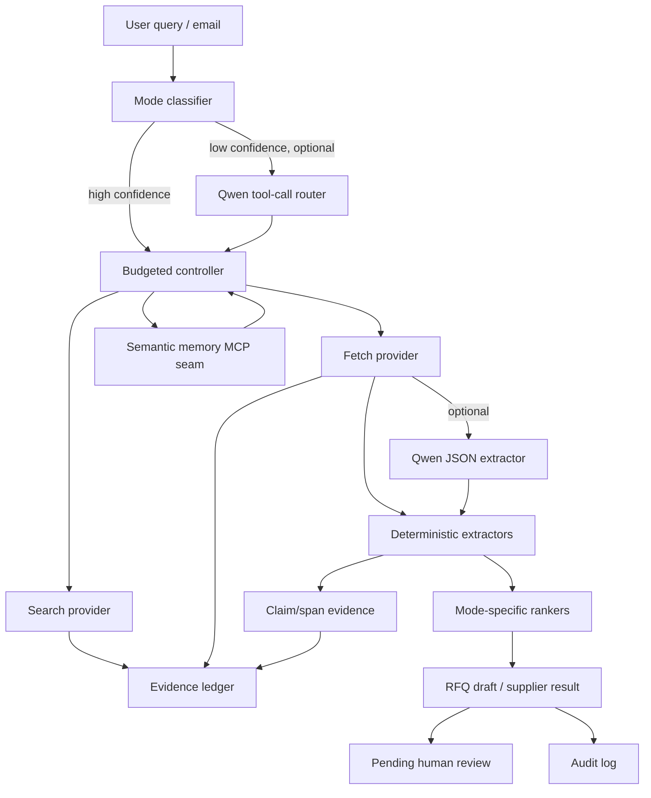

# spider-qwen

<p align="center">
  <picture>
    <source media="(prefers-color-scheme: dark)" srcset="spider-qwen-logo-darkmode.png">
    
  </picture>
</p>

**Spider-Qwen: procurement intelligence that hunts, maps, verifies, and recommends.**

Spider-Qwen is an agentic procurement scout built to map the supplier web,
detect commercial signals, and turn messy external information into sourcing
decisions. Give it a query like *"Find office cleaning vendors in Singapore and
prepare RFQ drafts"* and it returns an evidence-backed vendor shortlist plus
ready-to-review RFQ drafts — without ever submitting or sending anything.

It behaves like a digital sourcing analyst: it receives a buyer's request,
searches public sources through approved providers, verifies vendor evidence,
compares options, prepares recommendations, and leaves findings for human review.

- **Qwen-native layer:** optional Qwen JSON extraction (DashScope `json_object` mode), low-confidence tool-call routing, domain skill prompts, and an in-process MCP-compatible memory seam.
- **Web layer:** [TinyFish](https://docs.tinyfish.ai) Search + Fetch (primary), Qwen WebExtractor (single-page fallback), deterministic mocks for demos.
- **Guarantee:** every vendor / contact / price / RFQ output references ledger evidence; extracted claims carry span metadata when available.

> Current scope: `search → fetch → extract → rank → RFQ draft → persist evidence + memory`.
> **No** portal submission, browser automation, or code interpreter.

## Brand concept

Procurement is network work: suppliers, sub-suppliers, contracts, risks,
categories, lead times, market prices, compliance documents, and hidden
dependencies. The spider metaphor fits because the agent does not merely search;
it connects signals across the web and identifies where procurement should act.

- **Spider web:** supplier networks, market signals, RFQ trails, contract relationships.
- **Sharp gothic forms:** precision, authority, controlled aggression.
- **Monochrome palette:** serious enterprise intelligence, not playful SaaS.
- **Predatory tone:** actively hunts opportunities and risks instead of passively waiting.
- **Qwen reference:** the reasoning engine behind the agentic search layer.

## Why "evidence-first"

Procurement decisions need provenance. Every search result, fetched page, and
extracted fact is written to an append-only **evidence ledger** with SHA-256
hashes and timestamps. Downstream outputs carry lightweight `EvidenceRef`
pointers (`ledger_id`) back into that ledger — never bare URLs. Claim evidence
stores `claim_id`, `parent_ledger_id`, `start_char`, `end_char`, and `span_hash`
when the fact maps to fetched page text, and `spider-qwen evidence verify`
rechecks those spans. A ranked candidate with no evidence is dropped, not scored.

## Hackathon track strategy

Default submission strategy is **one project, strongest eligible track**. The
current rule read is that each Devpost submission identifies one track, while
multiple submissions must be unique and substantially different. Spider-Qwen is
therefore packaged as a Track 4 procurement autopilot unless organizer guidance
explicitly permits one project to be judged across multiple tracks. The
MemoryAgent loop is still implemented and documented as a supporting
differentiator.

## Install

Requires **Python 3.11+**.

```bash
git clone <repo> && cd spider-qwen
pip install -e ".[dev]"           # core + test deps
# optional extras:
pip install -e ".[qwen]"          # Qwen WebExtractor (openai SDK)
pip install -e ".[server]"        # FastAPI HTTP server
```

Copy `.env.example` to `.env` and add your keys (`.env` is gitignored — never commit it).

## Quickstart

No API keys needed — `--offline` uses deterministic mock providers:

```bash
spider-qwen classify "office cleaning Singapore"
spider-qwen run "office cleaning Singapore" --offline
spider-qwen run "500 ergonomic chairs Singapore" --mode product_exact_price --offline
spider-qwen evidence show <run_id>
spider-qwen evidence verify <run_id>
spider-qwen evidence graph <run_id>
spider-qwen memory show
spider-qwen review list
spider-qwen benchmark --gold-set spider_qwen/benchmarks/gold_set.json
```

Example output (trimmed):

```json
{
  "run_id": "run_abc123",
  "mode": "service_quote_required",
  "stop_reason": "min_validated_candidates_met",
  "validated_candidates": [
    {
      "vendor_name": "Example Cleaning Pte Ltd",
      "website": "https://example-cleaning.sg",
      "pricing_status": "QUOTE_REQUIRED",
      "quote_channel": { "type": "contact_email", "value": "sales@example-cleaning.sg",
        "evidence_ref": { "ledger_id": "ev_001", "url": "...", "snippet_hash": "...", "retrieved_at": "..." } },
      "score": 82.5
    }
  ],
  "rfq_drafts": [ { "status": "complete", "rfq_email_template": "Dear ...", "quote_channel": {"...": "..."} } ],
  "evidence_refs": [ "..." ]
}
```

## Architecture



## Procurement modes

| Mode | When | Output |
|---|---|---|
| `product_exact_price` | products with expected public pricing | priced candidates with `PricingStatus` + evidence |
| `service_quote_required` | services where price is quote-only | vendor shortlist + quote channel + **RFQ draft** |
| `contact_enrichment_only` | you have vendors, need contacts | evidence-backed contacts + validation signals |
| `revalidation` | refresh a stale memory fact | refreshed/`stale`/`disputed` fact (manual in v1) |

### Pricing ontology

`EXACT_PRICE · PRICE_RANGE · STARTING_FROM · RATE_CARD_FOUND · QUOTE_REQUIRED ·
CONTACT_FOR_PRICING · NOT_FOUND · CONFLICTING`. A missing price is **never** a
global failure — it becomes `NOT_FOUND`/`CONTACT_FOR_PRICING` and only blocks
`product_exact_price`, which requires a price by contract.

## Providers (swappable)

Selected via env or injection; both abstracted behind protocols.

| Env | Values | Default |
|---|---|---|
| `SPIDER_QWEN_SEARCH_PROVIDER` | `tinyfish` · `qwen_mcp` · `mock` | `tinyfish` |
| `SPIDER_QWEN_FETCH_PROVIDER` | `tinyfish` · `qwen_web_extractor` · `mock` | `tinyfish` |
| `QWEN_ROUTER_MODEL` | verified DashScope model id | `qwen3-max-2026-01-23` |
| `QWEN_JSON_EXTRACTOR_MODEL` | verified DashScope model id | `qwen-flash` |
| `QWEN_STRUCTURED_EXTRACTION_ENABLED` | `0` · `1` | `0` |
| `QWEN_ROUTER_FALLBACK_ENABLED` | `0` · `1` | `0` |

Qwen-assisted paths are optional and mocked in offline mode. Regex extractors
remain the deterministic default. Qwen JSON extraction runs over already-fetched
text and falls back cleanly on provider or schema errors.

## Benchmarks

Current offline gold set: `80` deterministic cases, `20` per mode.

| Metric | Offline result |
|---|---:|
| Mode classification accuracy | `0.95` |
| Quote-channel precision | `1.00` |
| RFQ draft completeness | `1.00` |
| Evidence coverage | `1.00` |

These are fixture-backed regression numbers, not live-web claims. A separate
`spider_qwen/benchmarks/live_validation_set.json` contains a small rate-limited
live validation set for reporting deployed-path behavior.

## RFQ drafts — and what spider-qwen never does

RFQ drafts contain exactly: `rfq_email_template`, `required_inputs_checklist`,
`quote_channel` (with `evidence_ref`), and `assumptions_and_limits`. Hard stops:

- No evidenced quote channel → no polished RFQ (status `incomplete`).
- Checklist completeness below threshold (default `0.65`) → status `incomplete`.

The agent **never** submits forms, sends email, drives a browser, or runs a code
interpreter. The audit log refuses to record any such action:

```python
AuditLog("run_demo").record("rfq_sent")  # raises PolicyViolation
```

## Configuration & governance

`spider_qwen/governance/policy_config.yaml` controls budgets (per mode), geo
defaults, privacy tags, RFQ behavior, and memory rules. Budgets enforce the stop
tuple `(max_tool_calls, min_validated_candidates, evidence_completeness_threshold)`.
Named-person contacts are tagged high-sensitivity and gated by default; generic
business contacts remain ungated. Human review events are persisted for
low-confidence classification, RFQ finalization, and disputed fact promotion.

## Memory loop

Semantic memory stores evidence-backed vendor facts, applies confidence decay,
marks stale facts, excludes disputed facts from RFQ enrichment, and recalls
active facts within a bounded context budget. Recalled quote channels are
re-recorded into the current run ledger as `semantic_memory` evidence so later
runs can change behavior without losing provenance.

## Project layout

```
spider_qwen/
  agent/         controller, budget, planner, policy, tool_registry, execution_context
  modes/         classifier, contracts (enums + candidate schemas), router
  tools/         tinyfish_client, search_service, fetch_service, qwen_web_extractor, qwen_json_extractor, provider_types
  extraction/    pricing, quote_channel, contact, vendor_metadata, service_match, dedupe
  ranking/       product/service/contact rankers, geo_strategy
  evidence/      models, ledger, dedupe, bundles, verifier, graph
  memory/        working, episodic, semantic, decay, promotion, revalidation, mcp
  rfq/           schema, checklist, generator
  governance/    policy_config.yaml, privacy, review, audit
  observability/ metrics, tracing
  api/           schema, cli, server
  benchmarks/    gold_set.json, evaluators, baseline comparison
docs/            architecture & design references
tests/           unit + end-to-end suite
```

## Testing

```bash
python -m pytest -q
```

Covers modes, pricing ontology, quote-channel detection, span verification,
Qwen provider request shapes, MCP memory recall, HITL review events, evidence
ledger, rankers, RFQ hard-stops, budget tracker, and **end-to-end** CLI runs.

## Offline API deployment

The FastAPI server defaults `/run` to `offline: true`, so demos do not need live
scraping keys.

```bash
pip install -e ".[server]"
uvicorn spider_qwen.api.server:app --host 0.0.0.0 --port 8000
```

The included `Dockerfile` serves the same offline-safe API path.

## Docs

- `docs/architecture.md`
- `docs/engineering.md`
- `docs/evidence_model.md`
- `docs/memory_design.md`
- `docs/ranking.md`
- `docs/benchmarking.md`

## Known limits

- Live providers can underperform on bot-walled sites; judging demo should use `--offline`.
- Claim spans exist when the claim is present in fetched text; link-only evidence remains ledger-backed without text offsets.
- Qwen model IDs should be re-verified before live demos.
- Browser automation, form submission, code interpreter, and non-Qwen LLMs are intentionally out of scope.

## License

MIT — see [LICENSE](LICENSE).
