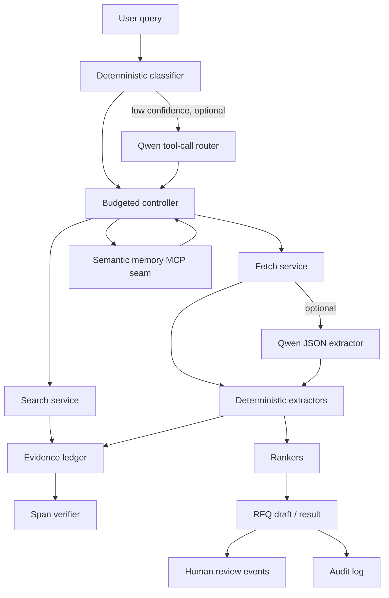

# Architecture

## Control vs. execution

The deterministic pipeline remains the default. Qwen is used in explicit,
optional seams: JSON extraction over fetched text and tool-call routing when the
keyword classifier is low-confidence. Both fail back to local behavior.

## Request lifecycle

1. **Classify** — `modes/classifier.py` scores intent terms → `ProcurementMode`.
2. **Route + budget** — `modes/router.py` maps mode → extractors/ranker; policy
   supplies the `Budget`.
3. **Gather (SEA-first)** — build geo query templates, `search` within budget,
   `fetch` candidate URLs, run extractors, build candidates with `EvidenceRef`s.
4. **Rank + validate** — per-mode ranker scores; `_is_validated` applies the
   mode contract + `evidence_completeness_threshold`.
5. **Global fallback** — if validated < `min_validated_candidates` and budget
   remains, re-gather with global templates.
6. **RFQ** (service mode only) — `rfq/generator.py` with hard stops.
7. **Review + persist** — pending review events, evidence ledger, supplier
   graph, traces, audit log, episodic and semantic memory.

## Determinism

Classifier and extractors are regex/heuristic by default. Providers are
injected, so the whole pipeline runs offline with mock providers. Optional Qwen
paths are schema-validated and mocked in tests.

## Import discipline

Internal modules import submodules directly (e.g. `..agent.budget`) rather than
package `__init__` aggregations, avoiding cycles. Services type-hint the budget
tracker under `TYPE_CHECKING` and duck-type it at runtime.
